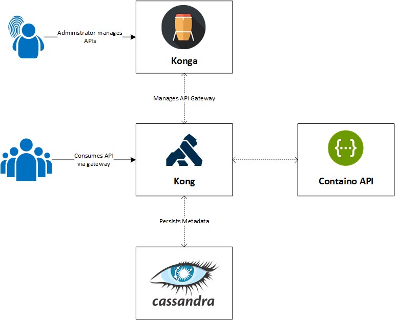

Containo
===========================

_This repository is dead, a new version of this scenario is coming soon._

[](https://travis-ci.org/tomkerkhove/containo)[](https://github.com/CoditEU/application-insights-connector/blob/master/LICENSE)

Containo is a fictious company that is building a product that provides a catalog of products to buy that 3rd parties can consume.

The platform is running .NET Core APIs that are running in Docker containers exposed via Kong as an API gateway.


# Architecture


# Installation
In order to run this sample you'll need to prepare your environment:

1. Create a new docker network - `docker network create api-ecosystem`
2. Install [Kong](https://getkong.org/install/docker) that is using Cassandra or PostgreSQL as a data store. ([Docker image](https://store.docker.com/images/kong))
3. Deploy the containo API via Docker Compose in `src/docker-compose.yml`
4. Create an API in Kong
```
curl -i -X POST \
  --url http://localhost:8001/apis/ \
  --data 'name=containo.api' \
  --data 'uris=//containo' \
  --data 'upstream_url=http://containo:80/api'
```
5. Start consuming the API
```
curl -i -X GET --url localhost:8000/containo/records
```

Prefer a UI to manage Kong? You can either use [Kong Dashboard](https://github.com/PGBI/kong-dashboard), [Kong CLI](https://github.com/passos/kong-cli) or [KongDash](https://github.com/ajaysreedhar/kongdash) desktop client, which are 3rd party tools that give you a Management UI.

**Important** - All containers need to be in the `api-ecosystem network`.

# License Information
This is licensed under The MIT License (MIT). Which means that you can use, copy, modify, merge, publish, distribute, sublicense, and/or sell copies of the web application. But you always need to state that Codit is the original author of this web application.
